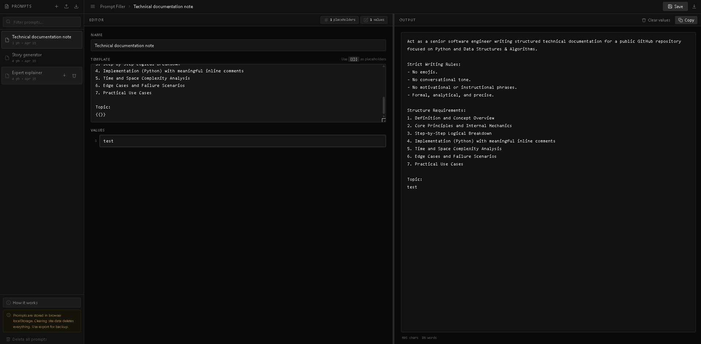

# Prompt Filler

A professional, dark-themed browser tool for managing reusable prompt templates with `{{}}` placeholders. Built with vanilla HTML, CSS, and JavaScript — no dependencies, no build step, no tracking.

## Live

[https://sayantan-b-dev.github.io/Lv1_Placeholder_Text_Filler/](https://sayantan-b-dev.github.io/Lv1_Placeholder_Text_Filler/)


---

## Features

### Editor
- Write templates using `{{}}` as placeholders — any number, anywhere in the text
- Input fields are generated automatically, one per placeholder, numbered in order
- Live output updates on every keystroke — no button required
- Word and character count shown beneath the output

### Prompt library (localStorage)
- All prompts are persisted in browser localStorage — no server, no account needed
- Full CRUD: create, rename, edit, save, delete
- Keyboard shortcut `Ctrl+S` / `Cmd+S` to save; `Ctrl+N` / `Cmd+N` for a new prompt
- Revert button to discard unsaved changes
- Unsaved changes are indicated by a dot in the header breadcrumb

### Sidebar
- Collapsible sidebar lists all saved prompts with placeholder count and last-edited date
- Filter/search prompts by name or template content
- Drag-and-drop to reorder prompts
- Per-prompt download and delete buttons appear on hover

### Import / Export
- **Export single prompt** — download as a `.md` file from the topbar
- **Export all prompts** — download a single `prompts-export.md` with all prompts separated by `---`
- **Import from markdown** — paste or upload a `.md` file; prompts separated by `---` are parsed and added to the library

#### Import format

Each block starts with the prompt name on the first line, followed by the template body. Blocks are separated by `---`:

```
My first prompt
Write a {{}} story about a {{}} who discovers {{}} and then {{}}.

---

My second prompt
Act as a {{}} expert and explain {{}} to a {{}} using {{}} as an analogy.
```

### Safety
- A persistent notice in the sidebar reminds you that clearing browser data deletes all prompts
- Use **Export all** regularly as a backup
- Re-import your export file at any time to restore

---

## How to use

1. Click **+** in the sidebar (or press `Ctrl+N`) to create a new prompt, or select an existing one
2. Write your template in the editor using `{{}}` for variable slots — e.g. `Write a {{}} story about a {{}} who {{}}.`
3. Fill in the numbered value fields that appear below the template
4. The final output is generated live in the right pane — click **Copy** to copy it to the clipboard
5. Press `Ctrl+S` or click **Save** when you want to keep the prompt in your library

---

## Example

**Template:**
```
Write a {{}} story about a {{}} who discovers {{}} and then {{}}.
```

**Values:**
1. `fantasy`
2. `young wizard`
3. `an ancient map`
4. `must save two kingdoms`

**Output:**
```
Write a fantasy story about a young wizard who discovers an ancient map and then must save two kingdoms.
```

---

## Installation

```bash
git clone https://github.com/sayantan-b-dev/Lv1_Placeholder_Text_Filler.git
cd Lv1_Placeholder_Text_Filler
```

Open `index.html` in any modern browser. No server, no build, no installation required.

---

## File structure

```
prompt-filler/
├── index.html      # Application markup
├── style.css       # All styles — dark theme, layout, components
├── script.js       # All logic — CRUD, storage, import/export, drag, resize
└── README.md       # This file
```

---

## Keyboard shortcuts

| Action | Shortcut |
|---|---|
| Save current prompt | `Ctrl+S` / `Cmd+S` |
| New prompt | `Ctrl+N` / `Cmd+N` |
| Close modal | `Escape` |

---

## Browser support

Works in all modern browsers (Chrome, Firefox, Safari, Edge). Requires localStorage to be available — private/incognito mode may limit persistence.

---

## Notes on localStorage

Browser localStorage is scoped to the origin (domain + port). Data is not shared across devices or browsers. Clearing site data in browser settings will erase all prompts. Export your prompts regularly using **Export all** to keep a `.md` backup you can re-import at any time.